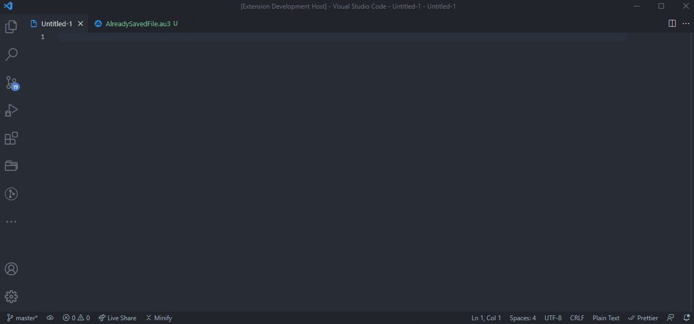
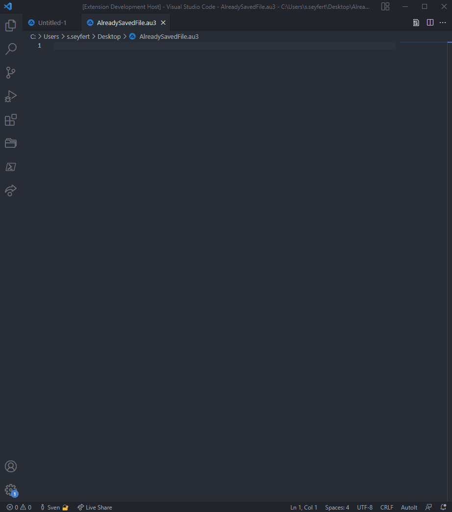

#####

<p align="center">
    
    <h2 align="center">Welcome to <code>VSCode-AutoItSnippets</code>【ツ】</h2>
</p>


[Description](#description) | [Features](#features) | [Getting started](#getting-started) | [Contributing](#contributing) | [License](#license) | [Acknowledgements](#acknowledgements)

## Description

VSCode-AutoItSnippets, display name "AutoIt Snippets" is a Visual Studio Code extension that provides helpful functions which are commonly used for all kind of programming or automation tasks within AutoIt. For example for the work with strings, dates, arrays, for getting information (system and more) or to record mouse actions or even for the work with GUIs.

## Features





#### Snippets

<details>
<summary>Snippets with "array" related context</summary>
<p>

| Snippet | Prefix | Description |
| :--- | :--- | :--- |
| ArrayCreate | !au3_arrayCreate | Create and initialize a 1D array as example. |
| ArrayCreate2D | !au3_arrayCreate2D | Create and initialize a 2D array as example. |
| ArrayDisplay | !au3_arrayDisplay | Default _ArrayDisplay with the array name as title. |
| ArrayItemsToString | !au3_arrayItemsToString | Combines all array items to a string. Similar to _ArrayToString function, but simpler. |
| FileContentToArray | !au3_fileContentToArray | File content or multiline string to array. |
| FilterEmptyLinesFromArray | !au3_filterEmptyLinesFromArray | Remove empty strings from array. |
| GetCount | !au3_getCount | Get array index count. |
| SortColumnSequenceOf2dArray | !au3_sortColumnSequenceOf2dArray | Sort column sequence alphabetically of a multidimensional array. |
| TransformToZeroBasedArray | !au3_transformToZeroBasedArray | Transform an array which starts on index one to a zero based array. |

<p>
</details>

<details>
<summary>Snippets with "convert" related context</summary>
<p>

| Snippet | Prefix | Description |
| :--- | :--- | :--- |
| Base64ToBinary | !au3_base64ToBinary | Convert a Base64 string to a binary string (vString). |
| BinaryToBase64 | !au3_binaryToBase64 | Reads a binary file and convert to Base64 string. |
| ConvertBinToInt | !au3_convertBinToInt | Convert binary to integer. |
| ConvertHexToInt | !au3_convertHexToInt | Convert hex to integer. |
| ConvertIntToBin | !au3_convertIntToBin | Convert integer to binary. |
| ConvertIntToHex | !au3_convertIntToHex | Convert integer to hex. |
| ConvertIntToOct | !au3_convertIntToOct | Convert integer to octal number. |
| HexColorInvert | !au3_hexColorInvert | Invert the given hex color. |

<p>
</details>

<details>
<summary>Snippets with "crypt" related context</summary>
<p>

| Snippet | Prefix | Description |
| :--- | :--- | :--- |
| DecryptFromUtf16LittleEndian | !au3_decryptFromUtf16LittleEndian | Decrypt from UTF16 Little Endian (UTF-16LE). |
| DecryptString | !au3_decryptString | Decrypt a encrypted string by your default crypt key to be human readable. |
| EncryptString | !au3_encryptString | Encrypt string by your default crypt key to encrypted unreadable string. |
| EncryptToUtf16LittleEndian | !au3_encryptToUtf16LittleEndian | Encrypt to UTF16 Little Endian (UTF-16LE). |

<p>
</details>

<details>
<summary>Snippets with "date" related context</summary>
<p>

| Snippet | Prefix | Description |
| :--- | :--- | :--- |
| CalendarWeekToDays | !au3_calendarWeekToDays | Get an array of days from the given calendar week. |
| GetDateDiffByBoundary | !au3_getDateDiffByBoundary | Get date diff by boundary (e. g. 90 days from the current day). |
| GetDateTime | !au3_getDateTime | Get current date and time as a timestamp. |
| GetHHMMSSOfSeconds | !au3_getHHMMSSOfSeconds | Get hours, minutes and seconds of given seconds (reverse of _getSecondsOfHHMMSS). |
| GetSecondsOfHHMMSS | !au3_getSecondsOfHHMMSS | Get seconds of given hours, minutes and seconds (reverse of _getHHMMSSOfSeconds). |
| GetTimerDiffInSecOrMin | !au3_getTimerDiffInSecOrMin | Get timer diff in seconds or minutes. |

<p>
</details>

<details>
<summary>Snippets with "debug" related context</summary>
<p>

| Snippet | Prefix | Description |
| :--- | :--- | :--- |
| DoesFunctionExists | !au3_doesFunctionExists | Check function exists by name of the function in the given file. |
| GetListOfAllFunctions | !au3_getListOfAllFunctions | List all functions of the given file to an array. |
| GetListOfAllVariables | !au3_getListOfAllVariables | List all variables of the given file to an array. |

<p>
</details>

<details>
<summary>Snippets with "file" related context</summary>
<p>

| Snippet | Prefix | Description |
| :--- | :--- | :--- |
| AddBackslashToPathEnd | !au3_addBackslashToPathEnd | Ensure trailing backslash for a path. |
| AppendToFile | !au3_appendToFile | Append text to file. |
| CreateFileWithSpecificSize | !au3_createFileWithSpecificSize | Create a dummy file with a specific file size. |
| ExistsNotAllowedCharacters | !au3_existsNotAllowedCharacters | Check string for not allowed characters regarding a file renaming action. |
| FileExistsBranch | !au3_fileExistsBranch | Check condition for file or directory exists. |
| GetFileContent | !au3_getFileContent | Get file content to string. |
| GetFileProperties | !au3_getFileProperties | Get all possible file properties to array. |
| GetFilePropertyValue | !au3_getFilePropertyValue | Get specific file property value. |
| GetFileShare | !au3_getFileShare | Get a list of FileShares as array. |
| GetJustFileExtension | !au3_getJustFileExtension | Get just the file extension of a file name or file path. |
| GetJustFileName | !au3_getJustFileName | Get just the file name of a file path (including the file extension). |
| GetJustPathOfFile | !au3_getJustPathOfFile | Get just the path of a file. |
| IsFileInUse | !au3_isFileInUse | Check is file in use by another process. |
| OpenFolder | !au3_openFolder | Open a given folder. |
| RelativeToAbsolutePath | !au3_relativeToAbsolutePath | Resolve relative path to absolute path. |
| SaveBinaryToFile | !au3_saveBinaryToFile | Create a binary file out of a binary string (vString). See _base64ToBinary function. |
| SetMaxDirectories | !au3_setMaxDirectories | Remove directories until the maximum count of directories is reached (e. g. for log directories with a timestamp as name). |
| SetMaxFiles | !au3_setMaxFiles | Remove files until the maximum count of files is reached (e. g. for log files with a timestamp as name). |
| SortFileByAscOrDesc | !au3_sortFileByAscOrDesc | Sort file content ascending or descending. |
| WriteFile | !au3_writeFile | Create or overwrite a file with the given content. |

<p>
</details>

<details>
<summary>Snippets with "game" related context</summary>
<p>

| Snippet | Prefix | Description |
| :--- | :--- | :--- |
| GetDistanceByPythagoras | !au3_getDistanceByPythagoras | Get the distance from one point to an other point by Pythagoras. |
| IsKeyPressed | !au3_isKeyPressed | Indicates that a key of the keyboard is pressed. Returns the boolean. |
| IsKeyReleased | !au3_isKeyReleased | Indicates that a key of the keyboard was released after it was pressed. Returns the boolean. |
| IsPointPositionBetween | !au3_isPointPositionBetween | Detects whether the position of a point is between two other positions. |

<p>
</details>

<details>
<summary>Snippets with "gui" related context</summary>
<p>

| Snippet | Prefix | Description |
| :--- | :--- | :--- |
| GuiFadeIn | !au3_guiFadeIn | Fade GUI window in. |
| GuiFadeOut | !au3_guiFadeOut | Fade GUI window out. |
| GetLabelSize | !au3_getLabelSize | Get the label size (with or height in pixel). |
| GetWindowHandle | !au3_getWindowHandle | Get window handle by title. |
| GuiAllowedInputs | !au3_guiAllowedInputs | Control GUI input data by allowed input values (keystrokes). |
| GuiInputFilterWMCommand | !au3_guiInputFilterWMCommand | Watch and filter specific GUI input controls by specific RegEx pattern. |
| GuiSetWinToCenter | !au3_guiSetWinToCenter | Set window to center on screen. |
| GuiWindowShakeAsHint | !au3_guiWindowShakeAsHint | Let the window shake a bit as a popup hint. |
| IsFocusOnGui | !au3_isFocusOnGui | Is given GUI in focus (window exists, window is visible, window is enabled and window is active). |
| IsMouseOnGui | !au3_isMouseOnGui | Is mouse over the GUI. |
| SetVisualStateOfStartBar | !au3_setVisualStateOfStartBar | Toggle visual state of the windows start bar. |
| ShowToolTipInfo | !au3_showToolTipInfo | Show tool tip text with padding. |
| StartBarToggle | !au3_startBarToggle | Show or hide windows start bar. |

<p>
</details>

<details>
<summary>Snippets with "math" related context</summary>
<p>

| Snippet | Prefix | Description |
| :--- | :--- | :--- |
| Get_GreatestCommonDivisor_LeastCommonMultiple | !au3_get_GreatestCommonDivisor_LeastCommonMultiple | Get 'greatest common divisor' and 'least common multiple' of to numbers. |
| IsNumberOdd | !au3_isNumberOdd | Is number odd or even. |
| KilometresToMiles | !au3_kilometresToMiles | Calculates the miles of given kilometers. |
| MilesToKilometres | !au3_milesToKilometres | Calculates the kilometers of given miles. |

<p>
</details>

<details>
<summary>Snippets with "misc" related context</summary>
<p>

| Snippet | Prefix | Description |
| :--- | :--- | :--- |
| DeleteCurrentScriptAfterRun | !au3_deleteCurrentScriptAfterRun | Delete current script after execution (after run). |
| DrawRecordedMouseMovesFromFile | !au3_drawRecordedMouseMovesFromFile | Draw recorded mouse moves (like a curve) from data of a file (see function _recordMouseMovesToConsole). |
| GetMacOrIpAddress | !au3_getMacOrIpAddress | Get MAC address or if not found the IP address. |
| GetMonitorResolution | !au3_getMonitorResolution | Get monitor resolution data as array. |
| GetProcessPathByPID | !au3_getProcessPathByPID | Get process path by process id (PID). |
| MsgBoxWithoutStop | !au3_msgBoxWithoutStop | Show a message box without stop/pause the program execution. |
| PressKeyOrSendStringSeveralTimes | !au3_pressKeyOrSendStringSeveralTimes | Press key (keystroke) or send a string several times. |
| RecordMouseMovesToConsole | !au3_recordMouseMovesToConsole | Record mouse move as 'MouseMove( ... )' string to console. Which is a preparation step for function _drawRecordedMouseMovesFromFile. |
| SetDisplayResolution | !au3_setDisplayResolution | Set display resolution to specific display width and height. |
| TalkOverPcVoice | !au3_talkOverPcVoice | Let the computer read out your text by the use of the SAPI API. |
| ToggleDesktopIcons | !au3_toggleDesktopIcons | Toggles the visibility of the desktop icons. |

<p>
</details>

<details>
<summary>Snippets with "output" related context</summary>
<p>

| Snippet | Prefix | Description |
| :--- | :--- | :--- |
| ConsoleWriteUnicodeChars | !au3_consoleWriteUnicodeChars | Write Unicode characters to the console. |
| GetAutoItEnvironmentInfos | !au3_getAutoItEnvironmentInfos | Get AutoIt environment information. |
| GetCommandLineOutput | !au3_getCommandLineOutput | Read command line output (result of a given command) to string. |
| GetComputerInfos | !au3_getComputerInfos | Get computer information. |
| NewLine | !au3_newLine | Get one newline (carriage return and line feed) by default or multiple newlines by optional parameter. |
| Print | !au3_print | Extends the default ConsoleWrite function by a default line break and optionally by start- and trailing pipe sign for better notice of whitespaces. |

<p>
</details>

<details>
<summary>Snippets with "string" related context</summary>
<p>

| Snippet | Prefix | Description |
| :--- | :--- | :--- |
| CreateRandomText | !au3_createRandomText | Create a random text (string based on different modi). |
| GetGuid | !au3_getGuid | Get a valid GUID. |
| GetGuidSegment | !au3_getGuidSegment | Get GUID segment which is used in function _getGuid. |
| GetUniqueMachineGuidString | !au3_getUniqueMachineGuidString | Get unique machine guid as string. |
| NormalizeStringLength | !au3_normalizeStringLength | Normalize string length for a good looking table like output result. |
| SplitStringByCountToArray | !au3_splitStringByCountToArray | Split a long string by defined count to an array. |
| StringProperWithoutSpaces | !au3_stringProperWithoutSpaces | Reformat the given string to proper case without spaces ('This string will be reformated to proper case without spaces' => 'ThisStringWillBeReformatedToProperCaseWithoutSpaces'). |
| StringProperWithSpaces | !au3_stringProperWithSpaces | Reformat the given string to proper case with spaces ('ThisStringWillBeReformatedToStringProperCaseWithSpaces' => 'This String Will Be Reformated To String Proper Case With Spaces'). |

<p>
</details>

<details>
<summary>Snippets with "zip" related context</summary>
<p>

| Snippet | Prefix | Description |
| :--- | :--- | :--- |
| CreateZipArchive | !au3_createZipArchive | Creates a zip archive by windows built in functionality. |
| ExtractZipArchive | !au3_extractZipArchive | Extract a zip archive by windows built in functionality. |
| ExtractZipVia7z | !au3_extractZipVia7z | Extract zip archive by 7z call. |

<p>
</details>

## Getting started

#### *Preconditions*

Actually there is no real precondition for this snippet extension.
But without using the snippets, it wouldn't make much sense.
That's why I recommend to [install](https://marketplace.visualstudio.com/items?itemName=Damien.autoit) the "AutoIt language extension for Visual Studio Code" by "Damien".

#### *Installation*

Variant 1 - by VSCode:

- Click the extensions button in VSCode and type in "AutoIt Snippets".
- Select the one by "Sven Seyfert".

Variant 2 - by VSCode launch:

- Quick open:
  - Linux: `Ctrl+P`
  - MacOS: `⌘+P`
  - Windows: `Ctrl+P`
- Paste the following command and press enter:

  ```
  ext install sven-seyfert.autoit-snippets
  ```

Variant 3 - by Visual Studio Marketplace:

- Go to the [AutoIt Snippets](https://marketplace.visualstudio.com/items?itemName=sven-seyfert.autoit-snippets) on the Visual Studio Marketplace
- Install

#### Usage

See the animated GIFs in the "Features" section above.

When your current file in VSCode is in "AutoIt language mode" then just type `!au3` and the intellicence and the auto-completion mode will give you the snippets overview.

## Contributing

Just look at [CONTRIBUTING](https://github.com/Sven-Seyfert/VSCode-AutoItSnippets/blob/main/docs/CONTRIBUTING.md), thank you!

## License

Distributed under the MIT License. See [LICENSE](https://github.com/Sven-Seyfert/VSCode-AutoItSnippets/blob/main/LICENSE.md) for more information.

## Acknowledgements

- Opportunity by [GitHub](https://github.com)
- Badges by [Shields](https://shields.io)
- Extension creation with the help of [Yo Code](https://github.com/Microsoft/vscode-generator-code) and [VSCE](https://github.com/microsoft/vscode-vsce)
- Utilities components by
  - Me (SnippetOverviewGenerator.au3)

##

[To the top](#)
